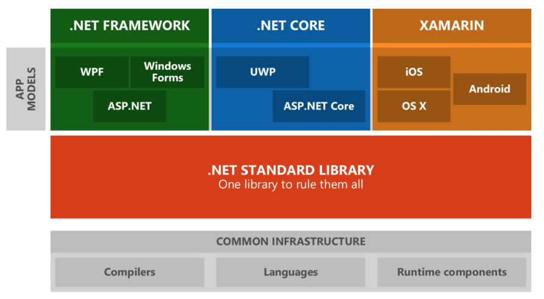

# C# Fundamentals
{: .no_toc }

## Table of contents
{: .no_toc .text-delta }

1. TOC
{:toc}

---

# what is C#? 
## Little background on C#
 - One of the primary languages that MicroSoft pushes in the .NET ecosystem.
 - C# is a very C style language, syntax-based laguage. 
 - Java is nearly identical syntax wised to C#. There is a lot of similarities between Java and C#. 

## Prerequisite
 - The .Net Ecosystems has been evolving and C# is going to develop on a .NET Framework (Not NET.Core developement).
 - The lastest version of Visual Studio
 - Make sure you have got comfort-level dealing with mathmatical operations and arrays, File IO operations.

### IDE - About 'Test Explorer'
* Location: Visual Studio > Test > Test Explorer (Ctrl+E,T) 
* What it is doing? It scans through the project and it tries to find the unit tests that are defined. 
* Test Methods are testing to make sure the testing harness is working well. 
* While testing(Debugging) on Visual Studio
- F5 Key : It will go to the next break point.
- F10 and F11 keys : It will step through the code and execute that line of code. It allows you to stay in the current method where you are at. 

### Tips before starting implementation
* Write 'throw new NotImplementedException();' in an empty method.  
- System.NotImplementedException: 'The method or operation is not implemented.'
- Meaning: Method isn't finished! Throw an error!
- Purpose: When you created a method, you are stubbing it out don't want to fill in the guts of what the method is going to do.
* Type thre slashes(///) above a method, property or field and the documentation code will show up. 
- Purpose of code Documentation: Explanation for what the method is doing. Description of what the two inputs are and what kinds of thing is returned. 
- Code comments are meant to provide a brief explanation in areas where the code is less self-explanatory. 
- This will cause the IDE to automatically create the commenting structure that you will need to fill in. 

/// 
 
  ///
  /// 
 
  /// <param name="input1"></param> 
  /// <param name="input2"></param> 
  /// <returns></returns> 

 

## C# .NET Features
### Pros and Cons as a language
 * Advanatges: Quick prototype windows form apps, Familiar C-style syntax, Entire .NET Framework suite of languages, Prevalent OOP language for the .NET ecosystem, A type-safe language
 * Disadvantages: Virtual machine and garbage collector(MacOS or Linux), Less performance(Higher overhead for virtual functions in the multiple inheritance, .NET Core and Mono(Only available in Window), Space allocation), Learning curve.

### Things to do using C#
 * GUI Development:  Windows Form, WPF (Windows Presentation Foundation) 
 * Web Development:  ASP .NET, ASP .NET MVC Framework
 * Game Development:  Game Client Development(Unity, Mono Platform) > Game Server Development (Speed is improved.)
 * IoT Development:  Supported C# Embeded version by MS, but the cost an arm and a leg.

### Current State of .NET Ecosystem

## C# Syntax
### Access Levels
* private – Code in the type that declares a private element, including code within contained types, can access the element. Other code file will not be able to access of this private code. 
"I created my codes and I don't want anybody messing with them!"
* private protected - Code in the class that declares a private protected element, or code in a derived class found in the same assembly as the base class. Combination of the private and protected. 
"It gets the a little bit of concept of inheritance, you can create the sub classes and those sub classes are able to access variables." 
* protected - Code in the class that declares a protected element, or a class derived from it, can access the element.
* internal - Code in the assembly that declares a friend element can access it.
"You will actually see the internal keywords in several places in the project. It is same thing as private but other code files in the same project will be able to access that method."
* protected internal – (Union of protected and internal) Code in the same class or the same assembly as a protected internal element, or within any class derived from the element's class, can access it.
* public - Any code that can see a public element can access it.

## Visibility, Variables, Arrays, Classes, Unit Tests
 
 
